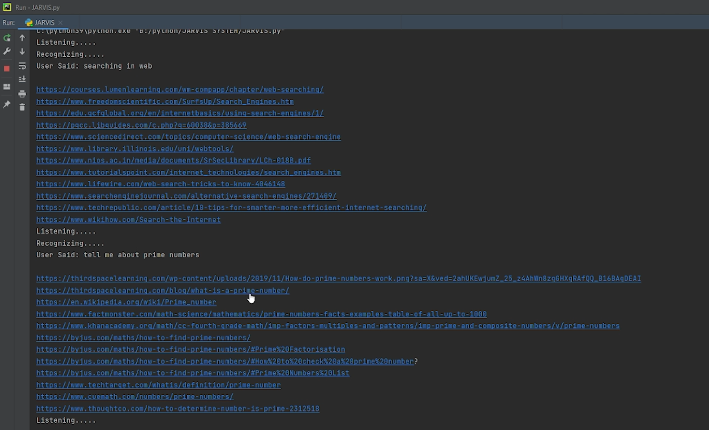
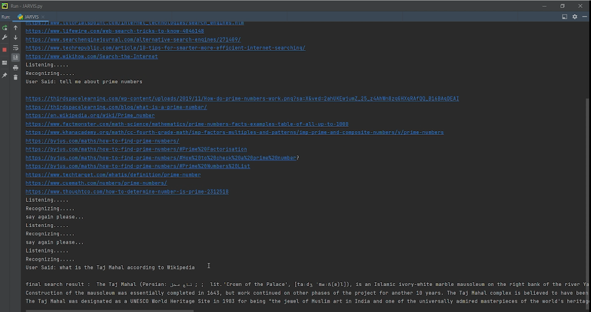
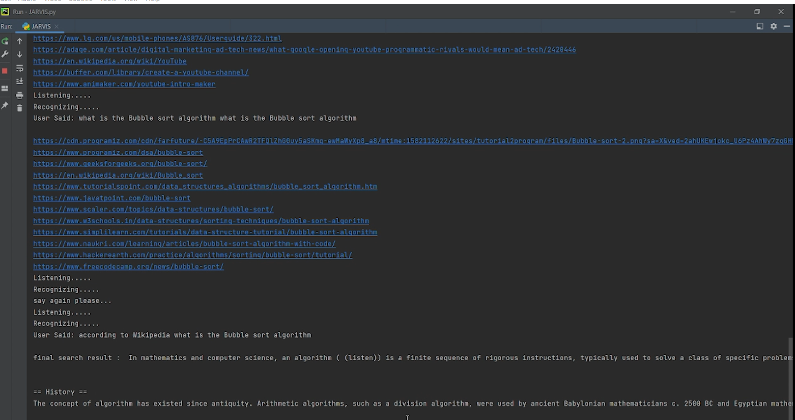

# JARVIS_ASSISTANT :star_struck: :open_mouth: :running: :star2:

[](https://shields.io/) [](https://shields.io/) [](https://shields.io/)[](https://shields.io/) [](https://shields.io/) 
<br>

***This new Jarvis Virtual Assistant using Python is created by Biswarup Bhattacharjee, student of BTECH, in University of Engineering and Management, Kolkata.***

**Email Id: bbiswa471@gmail.com.** 

**Contact No: 916290272740.** 


<p align="left">
<a href="https://www.facebook.com/profile.php?id=100070395300810" target="blank"></a>
<a href="https://instagram.com/biswarup2210" target="blank"></a>
<a href="https://github.com/biswa2210" target="blank"></a>
</p>

## About :point_down: 

<div align="justified">
    
Jarvis is a voice assistant created using Python. It can find anything instructed by us in internet and present it. It listens out voice recognizes and works.
 
</div>

## JARVIS DEMO VIDEO: :point_right: <a href="">Click here to watch</a>

## PYTHON PLAYLIST: :point_right: <a href="https://www.youtube.com/watch?v=SsKXFCSfQgw&list=PL0lbDlMJ1h4ikgkbohDuJurlnFvGzJCMr">Click here to watch</a>

## Folder Structure :point_down:

```bash
JARVIS
    └── jarvis.py
```
    
## Screenshots :point_down: 

<div align="center">
    
<a href="j1.png"></a>

<a href="j2.png"></a>

<a href="j3.png"></a>

</div>


